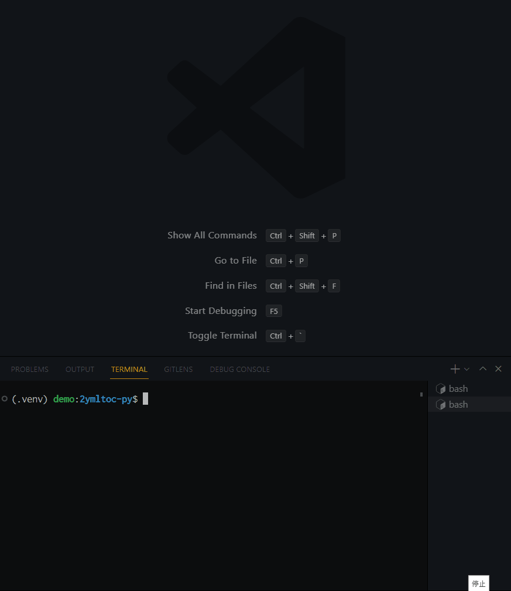
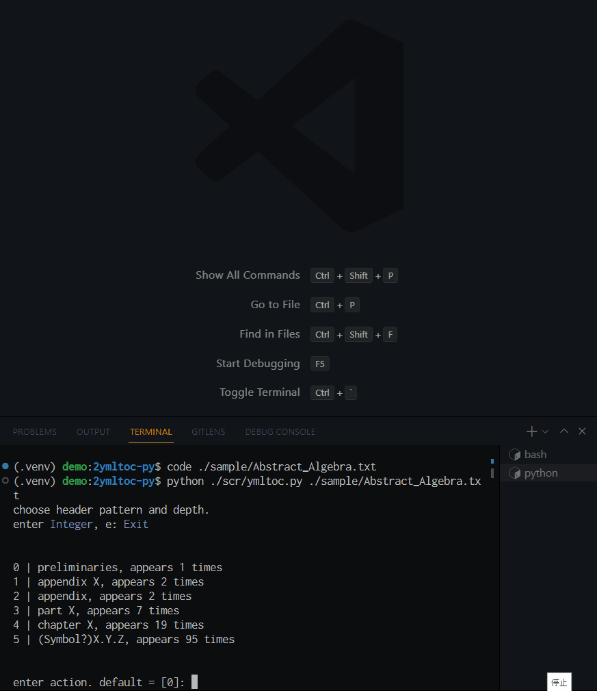

# Command line tool to convert ToC text file into structured yaml

## About

An interactive command line tool to convert ToC text file into yaml file suitable for [PDFToC](https://github.com/osanshouo/pdftoc-rs).
It detects typical ToC structures, such as "Part X", "Chapter Y" and "Section Z", and produces yaml file that represents the structure.

### **Caution**

The output yaml file might be invalid for PDFToC.
This is because it is just a simple convertor and not a tool for correcting defects in an original text file, such as missing page numbers, invalid use of reserved characters. To this end, it is recommended to inspect it by appropriate tools.

## Demo



Some input/output samples are at [sample folder](/sample/).

## Install

- Tested Environment
  - Windows 10 + WSL2 + Ubuntu 20.04
  - python 3.10.5 (pyenv 2.3.2) + poetry (1.1.11)

Follow a typical routine of setting up a virtual environment by pyenv + poetry.

Copy this project in some way, for instance, by git clone or create a repository from this template project.

```bash
git clone https://github.com/Shena4746/2ymltoc-py.git
cd ./2ymltoc-py
```

Enable python 3.10.5 at the top of the project directory. We do it simply by pyenv here.

```bash
pyenv local 3.10.5
```

It fails if you have not downloaded python 3.10.5. Run the following to download it, and try the previous command again.

```bash
pyenv install 3.10.5
```

Locate the python interpreter at {project-top}/.venv. Then let poetry perform a local installation of dependency.

```bash
python3 -m venv .venv
poetry install
```

Make sure that poetry uses the intended python interpreter.

```bash
poetry run which python
poetry run python --version
```

## Usage

```bash
# convert text file
python /path/to/scr/ymltoc.py text_file.txt
# for help
python /path/to/scr/ymltoc.py --help
```



## Select pattern and depth

```txt
0 | preliminaries, appears 1 times
1 | appendix X, appears 2 times
2 | appendix, appears 2 times
3 | part X, appears 7 times
4 | chapter X, appears 19 times
5 | (Symbol?)X.Y.Z, appears 95 times
```

Enter `4` to choose `chapter X`, which is reported to appear 19 times across the input text file.
Enter `e` to exit from this pattern selection.
If you choose a pattern, then you are asked to specify its depth (0 is the top level).

X, Y and Z represent some integers.
The pattern `(Symbol?)X.Y.Z` includes all of

- `§1.1`
- `3.1.`
- `6.2`
- `§8.`

## Repeat

You can choose as many patterns as you like from the displayed choices.
Moreover, you can set the same depth for different patterns.
In fact, the demo selects

```txt
part X -> depth=0
chapter X -> depth=1
preliminaries -> depth=0
appendix X -> depth=0
```

Enter `e` after you finish selecting all necessary patterns.

## Specify where the back matter starts (Optional)

This option is useful when your ToC text file has a back matter and when you would like to set it as depth=0.

```txt
0 | Appendix II: Category Theory 911
1 | References 916
2 | Index 919
```

Enter `1` if `References` and `Index` should be treated as the back matter.
This operation makes all subsequent lines back matter.
